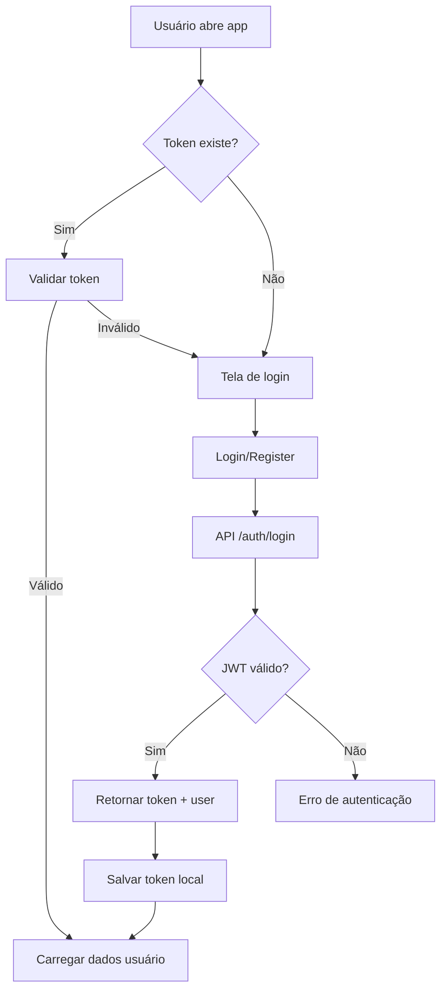
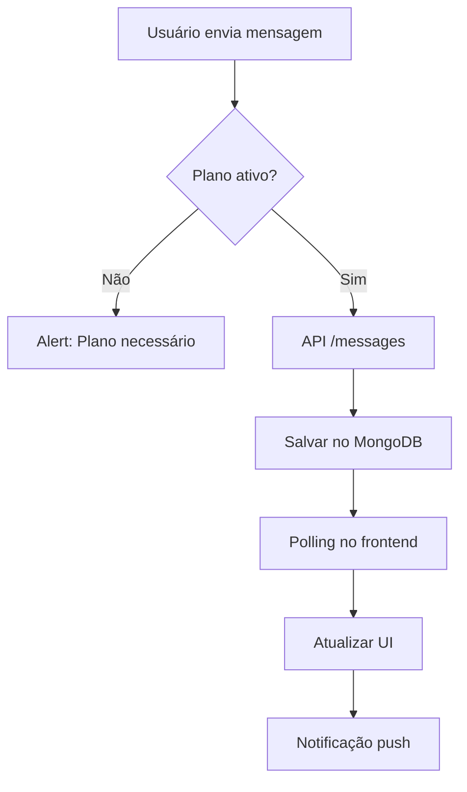
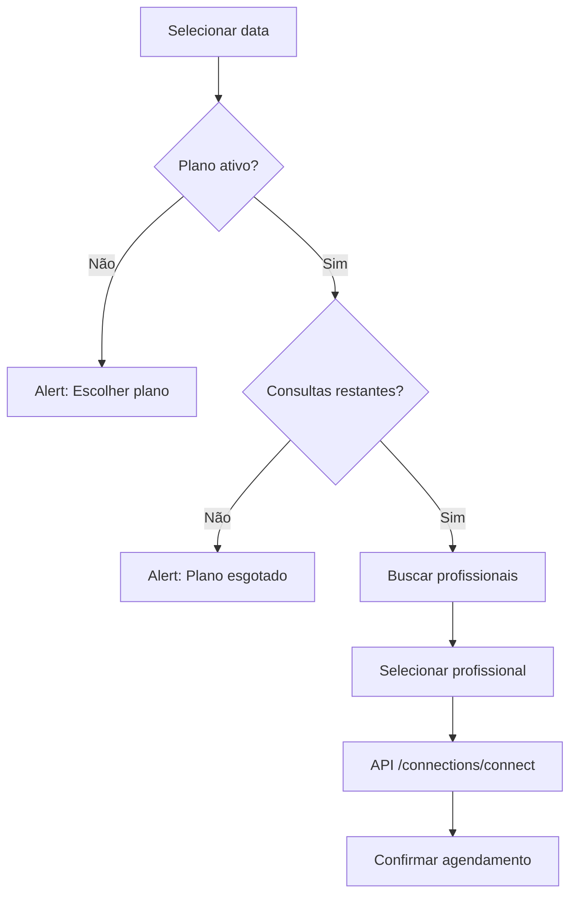

# 🏗️ Arquitetura Técnica - Conecta Saúde

## 📋 Visão Geral da Arquitetura

Este documento detalha a arquitetura técnica do sistema Conecta Saúde, incluindo decisões de design, padrões implementados e estrutura de código.

---

## 🗂️ Estrutura de Diretórios Detalhada

```
App_Conecta_Saude/
├── HealthcareApp/                    # 📱 Frontend React Native
│   ├── src/
│   │   ├── components/              # Componentes Reutilizáveis
│   │   │   ├── BackButton.js        # Botão de voltar padronizado
│   │   │   ├── EmojiPicker.js       # Seletor de emojis
│   │   │   └── AttachmentPicker.js  # Seletor de anexos
│   │   ├── context/                 # Gerenciamento de Estado Global
│   │   │   ├── AuthContext.js       # Autenticação e dados do usuário
│   │   │   └── ThemeContext.js      # Tema da aplicação
│   │   ├── hooks/                   # Custom Hooks
│   │   │   ├── useMessagePolling.js # Polling de mensagens
│   │   │   └── useTheme.js          # Hook para tema
│   │   ├── screens/                 # Telas Adicionais
│   │   │   ├── LoginScreen.js       # Tela de login
│   │   │   └── RegisterScreen.js    # Tela de cadastro
│   │   └── services/                # Serviços Externos
│   │       ├── api.js               # Cliente HTTP (Axios)
│   │       ├── biometricService.js  # Autenticação biométrica
│   │       └── notifications.js     # Notificações push
│   ├── *.js                         # Telas Principais
│   │   ├── HomeScreen.js            # Tela inicial do paciente
│   │   ├── CalendarScreen.js        # Agenda com calendário
│   │   ├── ChatScreen.js            # Conversas
│   │   ├── SearchScreen.js          # Busca de profissionais
│   │   ├── ProfileScreen.js         # Perfil do usuário
│   │   ├── VideoScreen.js           # Chamadas de vídeo
│   │   ├── PlansScreen.js           # Planos de assinatura
│   │   └── Professional*.js         # Telas do profissional
│   ├── assets/                      # Recursos Estáticos
│   ├── app.json                     # Configuração Expo
│   └── package.json                 # Dependências
│
├── backend/                         # 🖥️ Backend Node.js
│   ├── src/
│   │   ├── modules/                 # Módulos de Funcionalidade
│   │   │   ├── auth/                # Autenticação
│   │   │   │   ├── authController.js
│   │   │   │   └── authRoutes.js
│   │   │   └── users/               # Gerenciamento de Usuários
│   │   │       └── userModel.js
│   │   ├── middlewares/             # Middlewares Express
│   │   │   └── authMiddleware.js    # JWT Authentication
│   │   ├── config/                  # Configurações
│   │   │   └── passport.js          # OAuth Google
│   │   └── index.js                 # Ponto de entrada da API
│   ├── models/                      # Modelos MongoDB
│   │   ├── User.js                  # Usuário (paciente/profissional)
│   │   ├── Professional.js          # Dados específicos do profissional
│   │   ├── Conversation.js          # Conversas
│   │   ├── Message.js               # Mensagens
│   │   ├── Subscription.js          # Assinaturas
│   │   └── Connection.js            # Conexões paciente-profissional
│   ├── routes/                      # Rotas da API
│   │   ├── auth.js                  # Autenticação
│   │   ├── users.js                 # Usuários
│   │   ├── professionals.js         # Profissionais
│   │   ├── messages.js              # Mensagens
│   │   ├── subscriptions.js         # Assinaturas
│   │   └── connections.js           # Conexões
│   ├── middlewares/                 # Middlewares Globais
│   ├── config/                      # Configurações Globais
│   ├── index.js                     # Servidor Principal
│   └── package.json                 # Dependências
│
├── docker-compose.yml              # 🐳 Ambiente Docker
├── README.md                       # 📖 Documentação Principal
├── IMPLEMENTATION_REPORT.md        # 📋 Relatório de Implementação
├── DEPLOYMENT.md                   # 🚀 Guia de Deploy
├── SETUP.md                        # ⚙️ Guia de Configuração
└── GUIA_TESTES.md                  # 🧪 Guia de Testes
```

---

## 🔄 Fluxos de Dados

### 📱 Fluxo de Autenticação



### 💬 Fluxo de Mensagens



### 📅 Fluxo de Agendamento



---

## 🗃️ Modelos de Dados (MongoDB)

### 👤 User Model
```javascript
{
  _id: ObjectId,
  name: String (required),
  email: String (required, unique),
  password: String (required, hashed),
  cpf: String (required, validated),
  role: String (enum: ['patient', 'professional']),
  plan: String (default: 'sem plano'),
  consultationsLeft: Number (default: 0),
  professionalId: ObjectId (ref: 'Professional'),
  createdAt: Date,
  updatedAt: Date
}
```

### 🏥 Professional Model
```javascript
{
  _id: ObjectId,
  userId: ObjectId (ref: 'User'),
  specialty: String (required),
  qualifications: [String],
  bio: String,
  price: Number,
  availability: String,
  image: String,
  patients: [ObjectId] (ref: 'User'),
  createdAt: Date
}
```

### 💬 Conversation Model
```javascript
{
  _id: ObjectId,
  participants: [ObjectId] (ref: 'User'),
  type: String (enum: ['direct', 'group']),
  lastMessage: {
    content: String,
    sender: ObjectId,
    timestamp: Date
  },
  createdAt: Date,
  updatedAt: Date
}
```

### 📝 Message Model
```javascript
{
  _id: ObjectId,
  conversationId: ObjectId (ref: 'Conversation'),
  sender: ObjectId (ref: 'User'),
  content: String,
  type: String (enum: ['text', 'image', 'file']),
  attachments: [String], // URLs
  readBy: [ObjectId],
  createdAt: Date
}
```

### 💳 Subscription Model
```javascript
{
  _id: ObjectId,
  userId: ObjectId (ref: 'User'),
  plan: String (required),
  price: Number,
  consultations: Number,
  status: String (enum: ['active', 'inactive', 'cancelled']),
  startDate: Date,
  endDate: Date,
  createdAt: Date
}
```

---

## 🔧 Padrões de Desenvolvimento

### 🎯 Princípios SOLID
- **Single Responsibility**: Cada módulo/componente tem uma responsabilidade
- **Open/Closed**: Código extensível sem modificar existente
- **Liskov Substitution**: Interfaces consistentes
- **Interface Segregation**: Interfaces específicas
- **Dependency Inversion**: Dependências abstratas

### 📱 Padrões React Native
- **Functional Components** com Hooks
- **Context API** para estado global
- **Custom Hooks** para lógica reutilizável
- **Component Composition** sobre herança

### 🖥️ Padrões Backend
- **MVC Pattern**: Models, Routes, Controllers
- **Middleware Pattern**: Express middlewares
- **Repository Pattern**: Abstração de dados
- **Service Layer**: Lógica de negócio

### 🔒 Padrões de Segurança
- **JWT Authentication**: Stateless auth
- **Password Hashing**: bcrypt + salt
- **Input Validation**: Sanitização de dados
- **CORS**: Controle de origens
- **Rate Limiting**: Controle de requisições

---

## 🚀 Estratégia de Deploy

### 🐳 Dockerização
```yaml
# docker-compose.yml
version: '3.8'
services:
  mongodb:
    image: mongo:6.0
    ports:
      - "27017:27017"
    volumes:
      - mongodb_data:/data/db

  backend:
    build: ./backend
    ports:
      - "3000:3000"
    environment:
      - MONGODB_URI=mongodb://mongodb:27017/conectasaude
    depends_on:
      - mongodb

volumes:
  mongodb_data:
```

### ☁️ Cloud Deployment
- **Frontend**: Expo Application Services (EAS)
- **Backend**: Heroku / Railway / DigitalOcean
- **Database**: MongoDB Atlas
- **CDN**: Cloudflare para assets estáticos

### 🔄 CI/CD Pipeline
```yaml
# .github/workflows/deploy.yml
name: Deploy
on:
  push:
    branches: [main]
jobs:
  test:
    runs-on: ubuntu-latest
    steps:
      - uses: actions/checkout@v3
      - name: Setup Node.js
        uses: actions/setup-node@v3
      - run: npm install
      - run: npm test
  deploy:
    needs: test
    runs-on: ubuntu-latest
    steps:
      - name: Deploy Backend
        run: heroku deploy
      - name: Deploy Frontend
        run: eas build --platform all
```

---

## 📊 Monitoramento e Observabilidade

### 📈 Métricas a Monitorar
- **Performance**: Tempo de resposta das APIs
- **Uptime**: Disponibilidade do serviço
- **Errors**: Taxa de erro por endpoint
- **Usage**: Número de usuários ativos
- **Database**: Queries lentas, conexões

### 🛠️ Ferramentas
- **Application**: Winston (logs), Morgan (HTTP logs)
- **Infrastructure**: PM2 (process manager)
- **Database**: MongoDB Atlas monitoring
- **Frontend**: Expo Dev Tools, React DevTools

### 📋 Logs Estrutura
```json
{
  "timestamp": "2024-01-01T00:00:00.000Z",
  "level": "info|warn|error",
  "service": "backend|frontend",
  "userId": "user_id",
  "action": "login|register|send_message",
  "ip": "user_ip",
  "userAgent": "browser_info",
  "message": "descriptive_message",
  "metadata": {
    "endpoint": "/api/auth/login",
    "method": "POST",
    "statusCode": 200,
    "responseTime": 150
  }
}
```

---

## 🔧 Manutenção e Escalabilidade

### 📈 Estratégias de Escalabilidade
- **Horizontal**: Load balancer + múltiplas instâncias
- **Database**: Sharding MongoDB
- **Cache**: Redis para sessões e dados frequentes
- **CDN**: Cloudflare para assets estáticos
- **Microserviços**: Separação futura (auth, chat, video)

### 🔄 Manutenção Regular
- **Dependencies**: Atualização semanal
- **Security**: Scans automáticos
- **Performance**: Monitoramento contínuo
- **Backups**: Diários do banco de dados
- **Logs**: Rotação automática

### 🚨 Plano de Contingência
- **Failover**: Instâncias backup
- **Rollback**: Deploy reversível
- **Data Recovery**: Backups offsite
- **Communication**: Status page público

---

## 🎯 Decisões de Arquitetura

### ✅ Escolhas Técnicas Justificadas

| Decisão | Alternativa | Justificativa |
|---------|-------------|---------------|
| React Native + Expo | Flutter, Ionic | Comunidade maior, melhor DX |
| MongoDB | PostgreSQL | Flexibilidade de schema, JSON-like |
| JWT | Sessions | Stateless, melhor para mobile |
| Context API | Redux | Simplicidade, menos boilerplate |
| Axios | Fetch API | Interceptors, melhor error handling |
| bcrypt | argon2 | Compatibilidade, performance adequada |

### 🔄 Possíveis Melhorias Futuras

| Área | Melhoria | Impacto |
|------|----------|---------|
| Performance | GraphQL | Redução de overfetching |
| Real-time | Socket.io | Chat instantâneo |
| Video | WebRTC | Chamadas peer-to-peer |
| IA | ChatGPT API | Assistente virtual |
| Mobile | React Native Reanimated | Animações fluidas |

---

## 📚 Referências e Padrões

### 📖 Documentação Oficial
- [React Native](https://reactnative.dev/docs/getting-started)
- [Expo](https://docs.expo.dev/)
- [MongoDB](https://docs.mongodb.com/)
- [Express.js](https://expressjs.com/)

### 🎨 Design Patterns
- [React Patterns](https://reactpatterns.com/)
- [Node.js Best Practices](https://github.com/goldbergyoni/nodebestpractices)
- [MongoDB Patterns](https://www.mongodb.com/blog/post/building-with-patterns)

### 🔒 Segurança
- [OWASP Top 10](https://owasp.org/www-project-top-ten/)
- [JWT Best Practices](https://tools.ietf.org/html/rfc8725)
- [MongoDB Security](https://docs.mongodb.com/manual/security/)

---

*Este documento deve ser atualizado conforme a evolução da arquitetura.*</content>
<parameter name="filePath">c:\Users\user\Projetos\8. Projetos com Asafe\App_Conecta_Saude\ARCHITECTURE.md