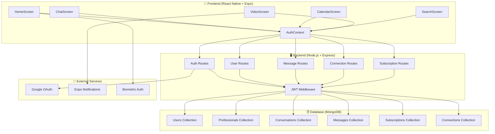

# 🏥 App Conecta Saúde

## 📋 Visão Geral

O **Conecta Saúde** é uma plataforma completa de saúde digital que conecta pacientes a profissionais de saúde qualificados. O sistema oferece uma experiência diferenciada com planos de assinatura, consultas por vídeo, chat em tempo real e agendamento inteligente.

### 🎯 Objetivo
Facilitar o acesso à saúde de qualidade, conectando pacientes e profissionais de forma segura, prática e eficiente.

## 🏗️ Arquitetura do Sistema



### 📱 Tecnologias Frontend
- **React Native** com **Expo** - Desenvolvimento mobile cross-platform
- **React Navigation** - Navegação por tabs e stack
- **Context API** - Gerenciamento de estado global (autenticação, tema)
- **Axios** - Cliente HTTP para comunicação com API
- **AsyncStorage** - Persistência local de dados
- **React Native Calendars** - Componente de calendário para agendamentos

### 🖥️ Tecnologias Backend
- **Node.js** com **Express.js** - Servidor REST API
- **MongoDB** com **Mongoose** - Banco de dados NoSQL
- **JWT (JSON Web Tokens)** - Autenticação segura
- **bcrypt** - Hash de senhas
- **Passport.js** - Autenticação OAuth (Google)
- **Socket.io** (planejado) - Comunicação em tempo real

### 🔧 Outras Tecnologias
- **Expo Notifications** - Notificações push
- **Expo Image Picker** - Seleção de imagens/anexos
- **Expo Local Authentication** - Biometria
- **CPF Validation** - Validação de documentos brasileiros

---

## 👥 Usuários do Sistema

### 🏥 Profissionais de Saúde
- **Psicólogos, Nutricionistas, Educadores Físicos** e outros especialistas
- Cadastro com validação de especialidade e qualificações
- Gerenciamento de agenda e pacientes
- Consultas por vídeo e chat
- Relatórios e registros de atendimento

### 👨‍⚕️ Pacientes
- Acesso a profissionais qualificados
- Sistema de planos de assinatura
- Agendamento de consultas por vídeo
- Chat direto com profissionais
- Histórico de conversas e atendimentos

---

## 🎨 Interface do Usuário

### 📱 Navegação Principal (Paciente)
- **🏠 Início**: Visão geral do plano e ações rápidas
- **📅 Agenda**: Calendário para agendar consultas
- **💬 Conversas**: Chat com profissionais conectados
- **🔍 Buscar**: Encontrar e conectar com profissionais
- **👤 Perfil**: Gerenciar conta e configurações

### 🏥 Navegação Principal (Profissional)
- **🏠 Início**: Visão geral de pacientes e agenda
- **📅 Agenda**: Gerenciamento de consultas agendadas
- **💬 Conversas**: Chat com pacientes conectados
- **🔍 Buscar**: Encontrar pacientes
- **👤 Perfil**: Gerenciar perfil profissional

---

## 💼 Funcionalidades Principais

### 🔐 Autenticação e Segurança
- **Cadastro**: Nome, email, senha, CPF (paciente) ou especialidade (profissional)
- **Login**: Email/senha ou Google OAuth
- **JWT Tokens**: Autenticação stateless com expiração
- **Validação CPF**: Algoritmo brasileiro para documentos
- **Hash de Senhas**: bcrypt com salt rounds

### 📋 Sistema de Planos
- **Planos Disponíveis**:
  - Básico: 5 consultas/mês
  - Intermediário: 10 consultas/mês
  - Premium: Consultas ilimitadas
- **Validação Obrigatória**: Pacientes precisam de plano ativo para:
  - Conectar com profissionais
  - Fazer chat
  - Agendar vídeo chamadas

### 🔗 Conexões Paciente-Profissional
- **Busca de Profissionais**: Por nome, especialidade
- **Visualização**: Foto, nome, especialidade, qualificações
- **Conexão**: Validação de plano obrigatória
- **Relacionamento**: 1 profissional por paciente (até plano permitir mais)

### 💬 Sistema de Comunicação
- **Chat em Tempo Real**: Mensagens texto com polling
- **Anexos**: Imagens e arquivos
- **Emojis**: Picker integrado
- **Notificações**: Push notifications
- **Histórico**: Conversas arquivadas

### 📹 Consultas por Vídeo
- **Integração**: Tela dedicada para chamadas
- **Validação**: Plano ativo obrigatório
- **Interface**: "Vídeo Chamada - Conecta Saúde"
- **Controles**: Iniciar/finalizar chamada

### 📅 Sistema de Agendamento
- **Calendário Interativo**: Seleção de datas
- **Validação**: Plano ativo e consultas disponíveis
- **Ações**: Agendar, ver histórico, gerenciar planos
- **Integração**: Conecta com busca de profissionais

---

## 🗂️ Estrutura do Projeto

```
App_Conecta_Saude/
├── HealthcareApp/                 # 📱 Frontend React Native
│   ├── src/
│   │   ├── components/           # Componentes reutilizáveis
│   │   ├── context/              # Context API (Auth, Theme)
│   │   ├── hooks/                # Custom hooks
│   │   ├── screens/              # Telas da aplicação
│   │   └── services/             # Serviços (API, notifications)
│   ├── assets/                   # Imagens e recursos
│   ├── *.js                      # Telas principais
│   └── package.json
│
├── backend/                      # 🖥️ Backend Node.js
│   ├── src/
│   │   ├── modules/
│   │   │   ├── auth/            # Autenticação
│   │   │   └── users/           # Usuários
│   │   ├── middlewares/         # Middlewares Express
│   │   ├── config/              # Configurações
│   │   └── index.js             # Ponto de entrada
│   ├── models/                  # Modelos MongoDB
│   ├── routes/                  # Rotas da API
│   ├── middlewares/             # Middlewares globais
│   ├── package.json
│   └── server.js                # Servidor principal
│
└── docker-compose.yml           # 🐳 Docker (banco de dados)
```

---

## 🚀 Como Executar

### 📋 Pré-requisitos
- **Node.js** 18+
- **MongoDB** (local ou Atlas)
- **Expo CLI** instalado globalmente
- **Git** para versionamento

### 🖥️ Backend
```bash
cd backend
npm install
npm run dev
```

### 📱 Frontend
```bash
cd HealthcareApp
npm install
npm start
```

### 🐳 Docker (Banco de Dados)
```bash
docker-compose up -d
```

---

## 🔧 Configurações

### 🌐 Variáveis de Ambiente
```env
# Backend
PORT=3000
MONGODB_URI=mongodb://localhost:27017/conectasaude
JWT_SECRET=your-secret-key
GOOGLE_CLIENT_ID=your-google-client-id
GOOGLE_CLIENT_SECRET=your-google-client-secret

# Frontend
EXPO_PUBLIC_API_URL=http://localhost:3000
```

### 🔑 Google OAuth
1. Acesse [Google Cloud Console](https://console.cloud.google.com/)
2. Crie um projeto
3. Configure OAuth 2.0 credentials
4. Adicione redirect URIs para desenvolvimento

---

## 📊 API Endpoints

### 👤 Autenticação
- `POST /auth/register` - Cadastro de usuário
- `POST /auth/login` - Login com email/senha
- `GET /auth/google` - Login com Google OAuth
- `GET /auth/me` - Dados do usuário autenticado

### 👥 Usuários
- `GET /users` - Listar usuários
- `GET /users/:id` - Detalhes do usuário
- `PUT /users/:id` - Atualizar usuário

### 🔗 Conexões
- `POST /connections/connect` - Conectar paciente-profissional
- `GET /connections` - Listar conexões do usuário

### 💬 Mensagens
- `GET /messages/:conversationId` - Mensagens da conversa
- `POST /messages` - Enviar mensagem

### 💳 Assinaturas
- `GET /subscriptions/plans` - Planos disponíveis
- `POST /subscriptions` - Criar assinatura
- `PUT /subscriptions/:id` - Atualizar plano

---

## 🎨 Design System

### 🎨 Cores
- **Primary**: Azul (#3B82F6)
- **Secondary**: Verde (#10B981)
- **Background**: Branco/escuro conforme tema
- **Text**: Preto/cinza (#1F2937)
- **Border**: Cinza claro (#E5E7EB)

### 📏 Componentes
- **Botões**: Bordas arredondadas, padding consistente
- **Cards**: Sombras suaves, bordas arredondadas
- **Inputs**: Bordas com foco azul
- **Typography**: Fontes escaláveis, pesos consistentes

---

## 🔒 Segurança

### 🛡️ Medidas Implementadas
- **JWT Tokens**: Autenticação stateless
- **Hash de Senhas**: bcrypt com salt
- **Validação de Input**: Sanitização de dados
- **Rate Limiting**: Controle de requisições (planejado)
- **HTTPS**: Comunicação criptografada
- **CORS**: Controle de origens permitidas

### 🔐 Boas Práticas
- Nunca armazenar senhas em texto plano
- Validar todos os inputs do usuário
- Usar prepared statements (Mongoose previne SQL injection)
- Logs de segurança para auditoria
- Atualizações regulares de dependências

---

## 📈 Roadmap

### 🚀 Próximas Funcionalidades
- [ ] **Notificações Push**: Melhorar sistema de notificações
- [ ] **Vídeo Chamadas**: Integração com WebRTC
- [ ] **Pagamentos**: Integração com gateways (Stripe, PagSeguro)
- [ ] **Dashboard**: Relatórios para profissionais
- [ ] **Avaliações**: Sistema de feedback
- [ ] **Prescrições**: Geração de receitas digitais
- [ ] **Integração SUS**: Conexão com sistema público

### 🔧 Melhorias Técnicas
- [ ] **Testes Unitários**: Jest para frontend/backend
- [ ] **CI/CD**: Pipelines automatizados
- [ ] **Monitoramento**: Logs e métricas
- [ ] **Cache**: Redis para performance
- [ ] **Microserviços**: Separação de responsabilidades

---

## 🤝 Contribuição

### 📝 Como Contribuir
1. Fork o projeto
2. Crie uma branch para sua feature (`git checkout -b feature/nova-funcionalidade`)
3. Commit suas mudanças (`git commit -m 'Adiciona nova funcionalidade'`)
4. Push para a branch (`git push origin feature/nova-funcionalidade`)
5. Abra um Pull Request

### 📋 Padrões de Código
- **ESLint**: Para linting de JavaScript
- **Prettier**: Para formatação consistente
- **Conventional Commits**: Para mensagens de commit
- **JSDoc**: Para documentação de funções

---

## 📞 Suporte

### 🐛 Reportar Bugs
- Use as **Issues** do GitHub
- Descreva o problema detalhadamente
- Inclua passos para reproduzir
- Adicione screenshots se possível

### 💡 Sugestões
- **Discussions** do GitHub para ideias
- **Issues** com label `enhancement`
- Descreva o impacto e benefício

### 📧 Contato
- **Email**: suporte@conectasaude.com
- **WhatsApp**: (11) 99999-9999
- **Site**: www.conectasaude.com

---

## 📜 Licença

Este projeto está sob a licença **MIT**. Veja o arquivo `LICENSE` para mais detalhes.

---

## 🙏 Agradecimentos

- **React Native Community** - Framework incrível
- **MongoDB** - Banco de dados flexível
- **Expo** - Plataforma de desenvolvimento mobile
- **Open Source Community** - Bibliotecas e ferramentas

---

*Desenvolvido com ❤️ para conectar saúde e bem-estar*
- Estilização com StyleSheet

## 🚀 Como Rodar o Projeto

### Pré-requisitos
- Node.js instalado
- MongoDB rodando localmente ou MongoDB Atlas
- Expo CLI para o frontend
- Conta Google para OAuth (client ID e secret)

### Backend
1. Navegue para a pasta `backend`:
   ```bash
   cd backend
   ```
2. Instale as dependências:
   ```bash
   npm install
   ```
3. Configure as variáveis de ambiente em um arquivo `.env`:
   ```
   MONGO_URI=mongodb://localhost:27017/conecta_saude
   JWT_SECRET=sua_chave_secreta
   GOOGLE_CLIENT_ID=sua_google_client_id
   GOOGLE_CLIENT_SECRET=sua_google_client_secret
   ```
4. Rode o servidor:
   ```bash
   npm start
   ```
   O servidor estará rodando em `http://localhost:3000`.

### Frontend
1. Navegue para a pasta `HealthcareApp`:
   ```bash
   cd HealthcareApp
   ```
2. Instale as dependências:
   ```bash
   npm install
   ```
3. Rode o app:
   ```bash
   npx expo start
   ```
   Use o Expo Go no seu dispositivo ou simulador.

## 🔄 Fluxo de Funcionamento
1. **Cadastro/Login**: Usuário se cadastra ou faz login via email/senha ou Google.
2. **Autenticação**: Backend valida credenciais e retorna JWT.
3. **Navegação**: No app, usuário navega entre telas (home, busca, perfil).
4. **Integração**: Futuramente, conectar com backend para buscar profissionais e gerenciar assinaturas.

## 📝 Notas
- O CPF é validado no backend (implementação básica; pode ser aprimorada).
- O login com Google cria usuários automaticamente.
- O frontend ainda não está integrado com o backend; o formulário de login é apenas UI.
- Para produção, use HTTPS e configure CORS se necessário.</content>
<parameter name="filePath">c:\Users\user\Projetos\8. Projetos com Asafe\App_Conecta_Saude\README.md